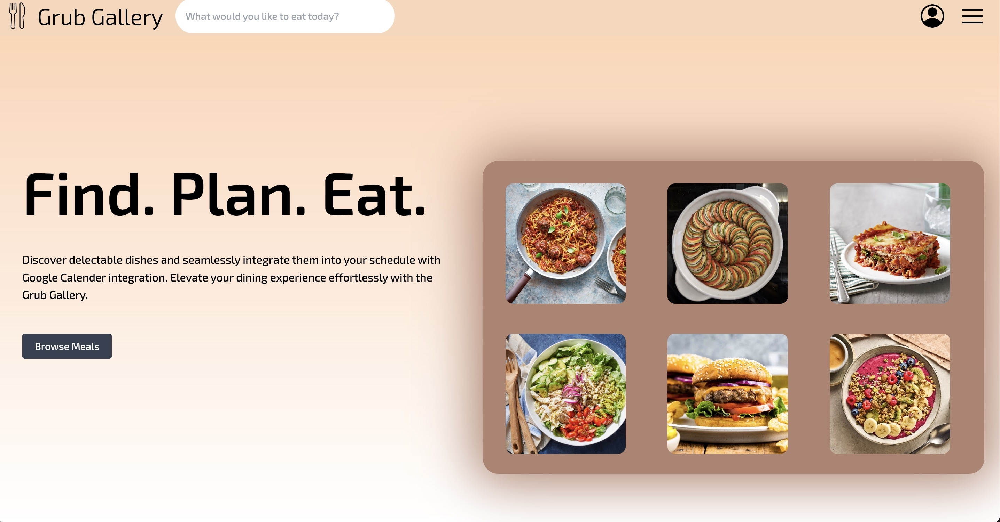

<!-- NOTE: this readme was based off of https://github.com/othneildrew/Best-README-Template/blob/master/BLANK_README.md -->

<!-- Improved compatibility of back to top link: See: https://github.com/othneildrew/Best-README-Template/pull/73 -->
<a name="readme-top"></a>


<!-- PROJECT SHIELDS -->
[![Contributors][contributors-shield]][contributors-url]
[![Forks][forks-shield]][forks-url]
[![Stargazers][stars-shield]][stars-url]
[![Issues][issues-shield]][issues-url]
<!-- These are prob not needed
[![MIT License][license-shield]][license-url]
[![LinkedIn][linkedin-shield]][linkedin-url]
-->


<!-- PROJECT LOGO -->
<br />
<div align="center">
  <a href="https://github.com/MatthewHilliard/Grub-Gallery">
    
  </a>

  <h3 align="center">Grub Gallery</h3>

  <p align="center">
    Personalized dishes and recipes with the click of a button!
    <br />
    <a href="https://www.youtube.com/watch?v=HiiPeKkUXfM" target= "_blank">View Demo</a>
    ·
    <a href="https://github.com/MatthewHilliard/Grub-Gallery/issues">Report Bug</a>
    ·
    <a href="https://github.com/MatthewHilliard/Grub-Gallery/issues">Request Feature</a>
  </p>
</div>


<!-- TABLE OF CONTENTS -->
<details>
  <summary>Table of Contents</summary>
  <ol>
    <li>
      <a href="#about-the-project">About The Project</a>
      <ul>
        <li><a href="#built-with">Built With</a></li>
      </ul>
    </li>
    <li>
      <a href="#getting-started">Getting Started</a>
      <ul>
        <li><a href="#prerequisites">Prerequisites</a></li>
        <li><a href="#installation">Installation</a></li>
      </ul>
    </li>
    <!-- <li><a href="#usage">Usage</a></li> -->
    <li><a href="#roadmap">Roadmap</a></li>
    <li><a href="#contributing">Contributing</a></li>
    <!-- <li><a href="#license">License</a></li> -->
    <li><a href="#contact">Contact</a></li>
    <li><a href="#acknowledgments">Acknowledgments</a></li>
  </ol>
</details>


<!-- ABOUT THE PROJECT -->
## About The Project

Grub Gallery is a dynamic web application built using the MERN (MongoDB, Express.js, React, Node.js) stack, integrating Google OAuth, Spoonacular API, and Google Calendar API. This project allows users to discover and personalize dishes and recipes effortlessly.

Project demo: https://www.youtube.com/watch?v=HiiPeKkUXfM
[](https://www.youtube.com/watch?v=HiiPeKkUXfM)

<p align="right">(<a href="#readme-top">back to top</a>)</p>


### Built With

[](https://skillicons.dev)

<p align="right">(<a href="#readme-top">back to top</a>)</p>


<!-- GETTING STARTED -->
## Getting Started

This is an example of how you can set up the project locally.
To get a local copy up and running follow these simple steps.

### Prerequisites

Please ensure that the following software is installed before cloning the repository:
* npm (you can check the version of `node` you are running with the command `node -v`)
  ```sh
  npm install npm@latest -g
  ```
* Google Cloud Console (please follow these steps from [Google](https://support.google.com/cloud/answer/6158849?hl=en) to initialize your project and obtain a `client ID` and `API_KEY`)
* Firebase (please follow these steps from [Firebase](https://firebase.google.com/docs/web/setup) to setup `OAuth 2.0` and obtain a `firebaseConfig` object)
* MongoDB (please follow these steps from [MongoDB](https://www.mongodb.com/docs/compass/current/connect/) to set up your cluster and obtain your cluster `URI`)
* Spoonacular (please follow these steps from [Spoonacular API](https://spoonacular.com/food-api/console#Dashboard) to obtain your Spoonacular `API_KEY`)

### Installation

_To install and run locally, please complete the following steps:_

1. Ensure that your have followed all of the steps from [prerequisites](#prerequisites)
3. Clone the repo
   ```sh
   git clone https://github.com/MatthewHilliard/Grub-Gallery.git
   ```
4. Create a `.env` file in the `client` directory (paste the following information, filling in the keys from above)
   ```env
    ################ Frontend environment variables ################
    # used for Google Calendar API (gapi service)
    VITE_GAPI_KEY=obtain_gapi_key_from_Google_Cloud_console
    VITE_GOOGLE_CLIENT_ID=obtain_client_id_key_from_Google_Cloud_console
    # leave scopes unchanged (not secret, but good practice to store here)
    VITE_SCOPE1=https://www.googleapis.com/auth/calendar
    VITE_SCOPE2=https://www.googleapis.com/auth/calendar.events

    # Firebase config keys
    VITE_FIREBASE_API_KEY=obtain_from_firebaseConfig
    VITE_FIREBASE_AUTH_DOMAIN=obtain_from_firebaseConfig
    VITE_FIREBASE_PROJECT_ID=obtain_from_firebaseConfig
    VITE_FIREBASE_STORAGE_BUCKET=obtain_from_firebaseConfig
    VITE_FIREBASE_MESSAGING_SENDER_ID=obtain_from_firebaseConfig
    VITE_FIREBASE_APP_ID=obtain_from_firebaseConfig
    VITE_FIREBASE_MEASUREMENT_ID=obtain_from_firebaseConfig
   ```
5. Create a `.env` file in the `server` directory (paste the following information, filling in the keys from above)
   ```env
    ################ Backend environment variables ################
    PORT=prefered_port                        # typically 3000
    MONGODB_URI=mongodb_uri_goes_here
    SPOONACULAR_KEY=spoonacular_api_key_goes_here
   ```
6. Install NPM packages (will install packages in `code`, `client`, and `server` directories)
   ```sh
   cd Grub-Gallery/code
   npm install
   npm run install-all
   ```
7. Run the application
   ```sh
   cd Grub-Gallery/code/server
   npm start
   ```

<p align="right">(<a href="#readme-top">back to top</a>)</p>


<!-- USAGE EXAMPLES 
## Usage

Use this space to show useful examples of how a project can be used. Additional screenshots, code examples and demos work well in this space. You may also link to more resources.

_For more examples, please refer to the [Documentation](https://example.com)_

<p align="right">(<a href="#readme-top">back to top</a>)</p>

-->

<!-- ROADMAP -->
## Roadmap

### Backend Development
- [x] Edit users SCHEMA in the backend
  - User information fields: name (str), age (number), username/id (str), diet (list of strings), favorites (list of recipes), history (list of recipes)
- [x] User OAuth implementation in frontend
  - Connect frontend to backend
  - Profile picture placement and save functionality
  - Design improvements for signed-in users
- [x] Setup endpoint for /searchMeal
  - Create search bar in the frontend
  - Make API call in the backend
  - Potential addition of filters in the future
- [x] React routing
- [x] Connect backend endpoints to frontend for add/remove favorites and history
- [ ] Abstract Google login into a backend API call (for security purposes)
- [ ] Fix users addFavorite --> prevent duplicates

### Frontend Development
- [x] Move profile picture to the top right
- [x] Create a separate page for a user already signed in (Unsure if needed yet)
- [x] Hamburger dropdown
  - Favorites
  - History
- [ ] Create default image for recipes missing image URLs

### UI/UX Design
- [x] Design the recipes page for browsing meals and the search function
  - Convert into a component
- [x] Create a favorites page
  - Styling
  - Connect backend endpoints to frontend for add/remove favorites
  - Use localStorage in SearchResults and BrowseMeals to maintain the list of dishes on page refresh

### Functionality Improvements
- [x] Add support for npm i and npm start in code and backend directories respectively (use concurrently)
- [x] Create addFavorite function (separate file)
- [x] Add UI polish for add/remove favorite (use a star PNG)
- [x] Immediately call listFavorites (refactored) after adding/removing a favorite
- [x] Refactor listFavorites to turn it into a separate function to grab the list of favorites from the backend

### Bug Fixes
- [x] Fix the search-meals bug (automatically re-load when BrowseMealsList changes)
- [x] Remove from favorites
- [x] Add an undo button for favorites

### Documentation and Maintenance
- [x] Add API keys to the .env file
- [x] Update GitHub README

See the [open issues](https://github.com/MatthewHilliard/Grub-Gallery/issues) for a full list of proposed features (and known issues).

<p align="right">(<a href="#readme-top">back to top</a>)</p>


<!-- CONTRIBUTING -->
## Contributing

Contributions are what make the open source community such an amazing place to learn, inspire, and create. Any contributions you make are **greatly appreciated**.

If you have a suggestion that would make this better, please fork the repo and create a pull request. You can also simply open an issue with the tag "enhancement".
Don't forget to give the project a star! Thanks again!

1. Fork the Project
2. Create your Feature Branch (`git checkout -b feature/AmazingFeature`)
3. Commit your Changes (`git commit -m 'Add some AmazingFeature'`)
4. Push to the Branch (`git push origin feature/AmazingFeature`)
5. Open a Pull Request

<p align="right">(<a href="#readme-top">back to top</a>)</p>


<!-- LICENSE -->
<!-- ## License

Distributed under the MIT License. See `LICENSE.txt` for more information.

<p align="right">(<a href="#readme-top">back to top</a>)</p> -->


<!-- CONTACT -->
## Contact

* Matthew Hilliard - mch2003@bu.edu
* William De Rocco - wderocco@bu.edu
* Brinja Vogler - bvogler@bu.edu
* Mensun Wang - mensun@bu.edu
* Sean Fung - sfung10@bu.edu

Project Link: [https://github.com/MatthewHilliard/Grub-Gallery](https://github.com/MatthewHilliard/Grub-Gallery)

<p align="right">(<a href="#readme-top">back to top</a>)</p>


<!-- ACKNOWLEDGMENTS -->
## Acknowledgments

Here are some extremely helpful resources if you are interested in working on this project, or a similar project!

* React Google Authentication - [PedroTech](https://www.youtube.com/watch?v=vDT7EnUpEoo)
* MERN Stack Tutorial - [PedroTech](https://www.youtube.com/watch?v=I7EDAR2GRVo)
* Google Docs API Tutorial - [Cooper Codes](https://www.youtube.com/watch?v=0KoZSVnTnkA)
* [Tailwind CSS Docs](https://tailwindcss.com/)
* [Vite-React Docs](https://vitejs.dev/guide/)


<p align="right">(<a href="#readme-top">back to top</a>)</p>


<!-- MARKDOWN LINKS & IMAGES -->
<!-- https://www.markdownguide.org/basic-syntax/#reference-style-links -->
[contributors-shield]: https://img.shields.io/github/contributors/MatthewHilliard/Grub-Gallery.svg?style=for-the-badge
[contributors-url]: https://github.com/MatthewHilliard/Grub-Gallery/graphs/contributors
[forks-shield]: https://img.shields.io/github/forks/MatthewHilliard/Grub-Gallery.svg?style=for-the-badge
[forks-url]: https://github.com/MatthewHilliard/Grub-Gallery/network/members
[stars-shield]: https://img.shields.io/github/stars/MatthewHilliard/Grub-Gallery.svg?style=for-the-badge
[stars-url]: https://github.com/MatthewHilliard/Grub-Gallery/stargazers
[issues-shield]: https://img.shields.io/github/issues/MatthewHilliard/Grub-Gallery.svg?style=for-the-badge
[issues-url]: https://github.com/MatthewHilliard/Grub-Gallery/issues
[license-shield]: https://img.shields.io/github/license/MatthewHilliard/Grub-Gallery.svg?style=for-the-badge
[license-url]: https://github.com/MatthewHilliard/Grub-Gallery/blob/master/LICENSE.txt
[linkedin-shield]: https://img.shields.io/badge/-LinkedIn-black.svg?style=for-the-badge&logo=linkedin&colorB=555
<!-- [linkedin-url]: https://linkedin.com/in/othneildrew -->
<!-- [product-screenshot]: images/screenshot.png -->
